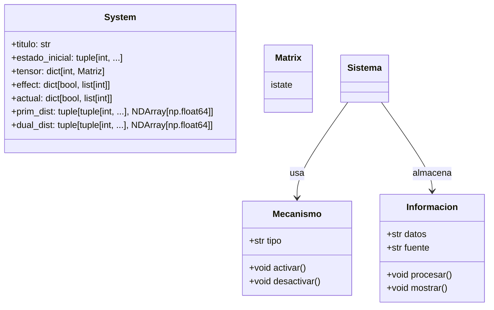

```mermaid
classDiagram

    class System {
        +titulo: str
        +estado_inicial: tuple[int, ...]
        +tensor: dict[int, Matriz]
        +effect: dict[bool, list[int]]
        +actual: dict[bool, list[int]]
        +prim_dist: tuple[tuple[int, ...], NDArray[np.float64]]
        +dual_dist: tuple[tuple[int, ...], NDArray[np.float64]]
    }

    class Matrix {
        istate    
    }

    class Mecanismo {
        +str tipo
        +void activar()
        +void desactivar()
    }

    class Informacion {
        +str datos
        +str fuente
        +void procesar()
        +void mostrar()
    }

    Sistema --> Mecanismo : usa
    Sistema --> Informacion : almacena
```