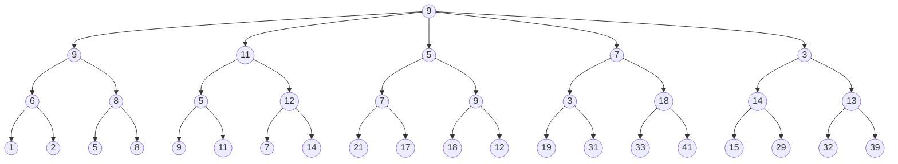

```mermaid
graph TD
    a((9)) --> aa((9))
    a --> ab((11))
    a --> ac((5))
    a --> ad((7))
    a --> ae((3))
    
    aa --> aaa((6))
    aa --> aab((8))
    
    aaa --> aaaa((1))
    aaa --> aaab((2))
    
    aab --> aaba((5))
    aab --> aabb((8))
    
    ab --> aba((5))
    ab --> abb((12))
    
    aba --> abaa((9))
    aba --> abab((11))

    abb --> abba((7))
    abb --> abbb((14))
    
    ac --> aca((7))
    ac --> acb((9))
    
    aca --> acaa((21))
    aca --> acab((17))

    acb --> acba((18))
    acb --> acbb((12))
    
    ad --> ada((3))
    ad --> adb((18))
    
    ada --> adaa((19))
    ada --> adab((31))
    
    adb --> adba((33))
    adb --> adbb((41))
    
    ae --> aea((14))
    ae --> aeb((13))
    
    aea --> aeaa((15))
    aea --> aeab((29))
    
    aeb --> aeba((32))
    aeb --> aebb((39))
```