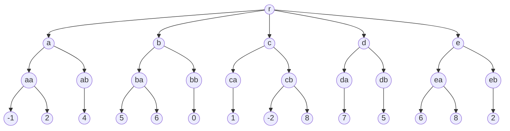

```mermaid
graph TD
    r((r)) --> a((a))
    r --> b((b))
    r --> c((c))
    r --> d((d))
    r --> e((e))
    
    a --> aa((aa))
    a --> ab((ab))
    
    b --> ba((ba))
    b --> bb((bb))
    
    c --> ca((ca))
    c --> cb((cb))
    
    d --> da((da))
    d --> db((db))
    
    e --> ea((ea))
    e --> eb((eb))
    
    aa --> aaa(("-1"))
    aa --> aab((2))
    
    ab --> aba((4))
    
    ba --> baa((5))
    ba --> bab((6))
    
    bb --> bba((0))
    
    ca --> caa((1))
    
    cb --> cba(("-2"))
    cb --> cbb((8))
    
    da --> daa((7))
    
    db --> dba((5))
    
    ea --> eaa((6))
    ea --> eab((8))
    
    eb --> eba((2))
```